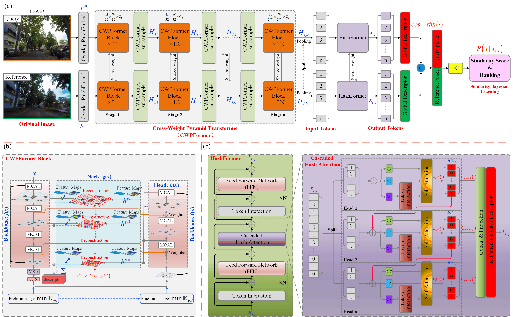
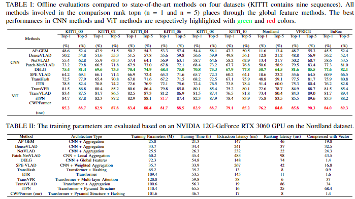

**CWPFormer** is a novel Visual Place Recognition (VPR) framework based on the Cross-weight Pyramid Transformer, designed for efficient robot navigation and localization tasks. This framework leverages advanced attention mechanisms like **Cascaded Hash Attention (CHA)** and a **Bayesian learning scheme** to enhance recognition accuracy and reduce computational redundancy, making it suitable for real-world robotics applications.



## Features

- **Cross-weight Pyramid Transformer (CWPFormer)**: Extracts multi-scale visual features with efficient attention-based mechanisms.
- **Cascaded Hash Attention (CHA)**: Reduces computational cost while improving attention diversity.
- **Bayesian Learning**: Enhances the place matching accuracy by learning compact hash codes.
- **Real-time VPR Performance**: Designed for autonomous vehicles, drones, and other perception-based unmanned systems.

## Results



## Requirements
The project requires Python 3.7+ and PyTorch 1.10+. All necessary dependencies are listed in the requirements.txt file.

## Installation
Clone the repository:

bash
Copy code
git clone https://github.com/your-username/CWPFormer.git
cd CWPFormer
Install the required Python packages:

bash
Copy code
pip install -r requirements.txt

## Usage

Training
To train the CWPFormer model on a dataset, run:

```bash
python train.py
```
This will train the model using the settings defined in config.py. The model checkpoints will be saved in the checkpoints/ directory, and logs will be available in the logs/ directory.

Testing
After training, you can test the model's performance on a test dataset by running:

```bash
python test.py
```
This will load the latest model checkpoint from checkpoints/ and evaluate it on the test data, reporting the accuracy.
